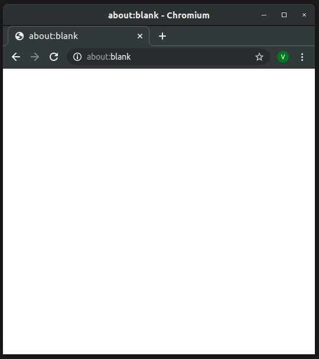

<!-- _class: lead -->
<!-- _footer: Photo by Mark Neal on Unsplash -->


# <!-- fit --> Pensando<br>em CSS

---

- As frutuções
- Os mitos
- Pensando em CSS

---

<!-- _class: invert -->
<!-- _footer: Photo by Matt Hardy on Unsplash -->


# <!-- fit --> As frustrações

---

# 1

## Muita coisa pra gravar

---

# 1

## <s>Muita coisa pra gravar</s>
## Vocabulário extenso dificulta aprendizado

<!-- de fato muita coisa! quantas propriedades diferentes devem existir? -->

---

# 2

## Ai, mas a cascata

<!-- você tem esse problema diariamente? isso é um pergunta honesta, porque na minha experiêccia eu não encontro isso, mesmo depois de ir pra uma empresa que não usa CSS Modules -->

---

# 2

## <s>Ai, mas a cascata</s>
## Cascata torna o resultado final imprevisível

---

# 3

## Eu que não mexo nisso, vai que quebra alguma coisa

---

# 3

## <s>Eu que não mexo nisso, vai que quebra alguma coisa</s>
## Difícil alterar e deletar código

---

# 4

## Ah, mas o IE

---

# 4

## <s>Ah, mas o IE</s>
## Retrocompatibilidade trava o desenvolvimento

---

1. Vocabulário extenso dificulta aprendizado
2. Cascata torna o resultado final imprevisível
3. Difícil alterar e deletar código
4. Retrocompatibilidade trava o desenvolvimento

---

<!-- _header: Parte 1 -->
<!-- _class: invert -->
<!-- _footer: Photo by Joanna Kosinska on Unsplash -->
# <!-- fit --> Os mitos


---

<!-- _class: invert -->

# Mito 1 🧙

Se nem todo browser a que damos suporte suporta, não podemos usar

---

> Eita nóis 🤦 Posso nem usar Grid por causa do IE 🙄

<!-- _footer: Photo by Caleb Lucas on Unsplash -->
<!-- _class: hipster-quote -->


---

# <!-- fit --> JS ≠ CSS

---



```js
async function* hispter(val) {
  while (isValid(val)) {
    yield val = await api(
      val?.toLowercase()
    );
  }
}
```

---

<!-- _header: Firefox 71 -->
<!-- _footer: https://codepen.io/vhfmag/pen/XWJJxry -->


```css
ul {
  display: grid;
  grid-template-columns:
    1fr 1fr;
  grid-gap: 1em;
}

li {
  display: grid;
  grid-row: span 3;
  grid-template-rows:
    subgrid;
}
```

---


---


---

<!-- _header: Firefox 71 -->
<!-- _footer: https://codepen.io/vhfmag/pen/XWJJxry -->


```css
ul {
  display: grid;
  grid-template-columns:
    1fr 1fr;
  grid-gap: 1em;
}

li {
  display: grid;
  grid-row: span 3;
  grid-template-rows:
    subgrid;
}
```

---

<!-- _header: Chrome 78 -->
<!-- _footer: https://codepen.io/vhfmag/pen/XWJJxry -->


```css
ul {
  display: grid;
  grid-template-columns:
    1fr 1fr;
  grid-gap: 1em;
}

li {
  display: grid;
  grid-row: span 3;
  grid-template-rows:
    subgrid;
}
```

---

<!-- _header: Chrome 78 -->
<!-- _footer: https://codepen.io/vhfmag/pen/XWJJxry -->


```css
li {
  display: flex;
  flex-direction: column;
}

@supports (
  grid-template-rows: subgrid
) {
  li {
    display: grid;
    grid-row: span 3;
    grid-template-rows:
      subgrid;
  }
}
```

---

<!-- _header: IE 11 -->
<!-- _footer: https://codepen.io/vhfmag/pen/XWJJxry -->


```css
li {
  display: flex;
  flex-direction: column;
}

@supports (
  grid-template-rows: subgrid
) {
  li {
    display: grid;
    grid-row: span 3;
    grid-template-rows:
      subgrid;
  }
}
```

---


---

# <!-- fit --> JS<br>≠<br>CSS

---

# <!-- fit --> Turing completa<br>≠<br>DSL

---

## Rule of least power

O príncipio de design que sugere escolher a linguagem de programação menos poderosa aplicável para um dado propósito.

<!--  _footer: https://www.w3.org/2001/tag/doc/leastPower.html -->

---

<!-- _class: invert -->
# Fato 1 🕵

O CSS é resiliente, aplique _progressive enhancement_ e seja feliz

---

<!-- _class: invert -->
# Mito 2 🧙

Você sempre precisa brigar com o navegador

---

<iframe
  loading="lazy"
  height="700"
  style="width: 100%; margin: auto"
  scrolling="no"
  title="Fallback de grid"
  src="https://codepen.io/brundolf/embed/gRaREv?height=700&theme-id=dark&default-tab=css,result"
  frameborder="no"
  allowtransparency="true"
  allowfullscreen="true"
>
  See the Pen <a href='https://codepen.io/brundolf/pen/gRaREv'>CSS is Awesome</a> by Brandon (<a href='https://codepen.io/brundolf'>@brundolf</a>) on <a href='https://codepen.io'>CodePen</a>.
</iframe>

---

<iframe
  loading="lazy"
  height="700"
  style="width: 100%;"
  scrolling="no"
  title="Fallback de grid"
  src="https://codepen.io/vhfmag/embed/PowoMGq?height=700&theme-id=dark&default-tab=result"
  frameborder="no"
  allowtransparency="true"
  allowfullscreen="true"
>
  See the Pen <a href='https://codepen.io/vhfmag/pen/PowoMGq'>Fallback de grid</a> by Victor Magalhães (<a href='https://codepen.io/vhfmag'>@vhfmag</a>) on <a href='https://codepen.io'>CodePen</a>.
</iframe>

---


<!-- _color: white -->
# <!-- fit --> O navegador é mais<br>esperto que você

<!-- _footer: Photo by Franck V. on Unsplash -->

---

<div class="iframe-wrapper">
  <iframe
    loading="lazy"
    height="700"
    style="width: 100%;"
    scrolling="no"
    title="AEA 2018 — Teaser Card"
    src="https://codepen.io/jensimmons/embed/gezmMa?height=700&theme-id=dark&default-tab=result"
    frameborder="no"
    allowtransparency="true"
    allowfullscreen="true"
  >
    See the Pen <a href='https://codepen.io/jensimmons/pen/gezmMa'>AEA 2018 — Teaser Card</a> by Jen Simmons
    (<a href='https://codepen.io/jensimmons'>@jensimmons</a>) on <a href='https://codepen.io'>CodePen</a>.
  </iframe>
</div>

---

<!-- _class: invert -->
# Fato 2 🕵

Se você e o navegador falarem a mesma língua, você vai usar as ferramentas certas e delegar a ele o que ele sabe fazer melhor do que você

<small style="margin-top: 1em;">

- Evite tamanhos fixos e `position: absolute`
- Pesquise o layout mais apropriado pro seu caso

</small>

---
<!-- 
<!-- _class: invert --/>
# Mito 3 🧙

P*rra de cascata

---

<!-- _class: invert --/>
# Fato 3 🕵

Use a cascata... as vezes

--- -->

<!-- _header: Parte 1 -->
<!-- _class: invert -->
<!-- _footer: Photo by Mark Rasmuson on Unsplash -->
# <!-- fit --> Falando CSS


---

<!-- _class: invert -->
# Os dois valores de display

---

<!-- _class: two-col -->

- `block`
- `inline-block`
- `inline`
- `table`
- `inline-table`
- `grid`
- `inline-grid`
- `flex`
- `inline-flex`

---

<style scoped>
  li {
    display: block grid;
    text-align: center;
    grid-template-columns: minmax(0, 1fr) 1em minmax(0, 1fr);
  }

  li :nth-child(2) {
    text-align: left;
    align-self: flex-start;
    justify-self: flex-start;
  }

  li :nth-child(1) {
    text-align: right;
    align-self: flex-end;
    justify-self: flex-end;
  }
</style>

- `block` ↔ `block flow-root`
- `inline-block` ↔ `inline flow-root`
- `inline` ↔ `inline flow`
- `table` ↔ `block table`
- `inline-table` ↔ `inline table`
- `grid` ↔ `block grid`
- `inline-grid` ↔ `inline grid`
- `flex` ↔ `block flex`
- `inline-flex` ↔ `inline flex`

---

# <q>Outer display type (ODT)</q>

`inline` & `block`

Dita como o elemento se comporta no *flow layout*

---

# <q>Inner display type (IDT)</q>

`flow`, `flow-root`, `table`, `flex` & `grid`

Dita como o elemento dispõe seus filhos

---

<!-- _class: invert two-col -->
# Layouts

- Flow
- Flex
- Grid
- Multicoluna

---

# Flow

<style scoped>
  p {
    max-width: 20ch;
    margin: 0 auto;
  }
</style>

O bom e velho layout, que de tão padrão a gente nem se dá conta

---

- Filhos com ODT = `block` tomam a linha inteira
- Filhos com ODT = `inline` tomam parte da linha e podem ser dividos entre linhas
- A propriedade `float` permite que múltiplos elementos dividam a mesma linha

---

<iframe
  loading="lazy"
  height="700"
  style="width: 100%;"
  title="CSS Shape Demo by Jen Simmons"
  src="https://labs.jensimmons.com/2016/examples/shapes-4.html"
  frameborder="no"
  allowtransparency="true"
  allowfullscreen="true"
>
</iframe>

---

# Multicoluna

<style scoped>
  p {
    column-width: 20ch;
  }
</style>

Similar ao *flow* mas divido em colunas, típico do design gráfico. Existe desde o IE10 🤯

---

<div class="iframe-wrapper">
  <iframe
    loading="lazy"
    height="700"
    style="width: 100%;"
    scrolling="no"
    title="Image Gallery — multicolumn layout (7/9)"
    src="https://codepen.io/jensimmons/embed/BKPGov?height=700&theme-id=dark&default-tab=result"
    frameborder="no"
    allowtransparency="true"
    allowfullscreen="true"
  >
    See the Pen <a href='https://codepen.io/jensimmons/pen/BKPGov'>AEA 2018 — Teaser Card</a> by Jen Simmons
    (<a href='https://codepen.io/jensimmons'>@jensimmons</a>) on <a href='https://codepen.io'>CodePen</a>.
  </iframe>
</div>

---

# Flex

O mais imitado ¯\\\_(ツ)\_/¯

---

- Layout unidimensional (com wrap)
- Controle sobre crescimento e encolhimento
- Controle sobre alinhamento nas duas dimensões

---

<style scoped>
  .flex {
    display: flex;
    gap: 1em;
  }

  .flex * {
    hyphens: auto;
    font-size: 0.75em;
  }

  .flex > :nth-child(1) {
    flex: 1 4 auto;
  }

  .flex > :nth-child(2) {
    flex: 2 2 auto;
  }

  .flex > :nth-child(3) {
    flex: 4 1 auto;
  }
</style>

flex:

<div class="resizable flex">
  <button>1 4 auto</button>
  <button>2 2 auto</button>
  <button>4 1 auto</button>
</div>

---

# Grid

Um layout sem volta (tem grid em tudo, eu juro)

---

- Layout bidimensional
- Nova unidade: `fr`
- Novos valores: `min-content`, `max-content`
- Novas funções: `repeat`, `minmax`, `fit-content`

---

<!-- _footer: Photo by viklundvisuals on Unsplash -->

<style scoped>
.grid-overlap {
  height: 85%;
  display: grid;
  grid-template-columns: 1fr 32ch 1fr;
  grid-template-rows: 300px 3em 1fr;
}

.grid-overlap * {
  margin: 0;
}

.grid-overlap :nth-child(1) {
  grid-row: 1 / 3;
  grid-column: 1 / -1;
  
}

.grid-overlap :nth-child(1) img {
  width: 100% !important;
  height: 100%;
  object-fit: cover;
}

.grid-overlap :nth-child(2) {
  padding: 0.5em;
  grid-row: 2 / 4;
  grid-column: 2;
  background-color: white;
  box-shadow: 0 0 15px rgba(0, 0, 0, 0.1);
  border-radius: 4pt;
}
</style>

<div class="grid-overlap">


Venha pro nosso treino de surf e reprograme o seu DNA com nossas técnicas quânticas. Resultado garantido!

</div>

---

<!-- _footer: Photo by viklundvisuals on Unsplash -->


---

<div class="iframe-wrapper">
  <iframe
    loading="lazy"
    height="700"
    style="width: 100%;"
    scrolling="no"
    title="Fallback de grid"
    src="https://codepen.io/vhfmag/embed/XWJJxry?height=700&theme-id=dark&default-tab=result"
    frameborder="no"
    allowtransparency="true"
    allowfullscreen="true"
  >
    See the Pen <a href='https://codepen.io/vhfmag/pen/XWJJxry'>Fallback de grid</a> by Victor Magalhães (<a href='https://codepen.io/vhfmag'>@vhfmag</a>) on <a href='https://codepen.io'>CodePen</a>.
  </iframe>
</div>

---

<!-- _class: invert -->

# Expressividade do CSS

---

<style scoped>
  blockquote {
    text-align: justify;
    text-align-last: left;
  }
</style>

> Paragraphs of text that are too long are difficult to follow, and paragraphs of text that are too thin are difficult to read. **Ideally, blocks of text should be roughly 70 characters wide**. Be sure to keep them at least between 50 and 120 characters wide.
> — [Página de tipografia do design system da Adobe](https://spectrum.adobe.com/page/typography/)

---

```css
p {
  width: 70ch; /* 🤷 */
}
```

---

**Tipografia fluida**

Exemplo:<br>Fonte de 16 a 24px pra uma largura de 400 a 600px

---

<div class="iframe-wrapper">
  <iframe
    loading="lazy"
    height="700"
    style="width: 100%;"
    scrolling="no"
    title="Fallback de grid"
    src="https://codepen.io/vhfmag/embed/QWwbPVK?height=700&theme-id=dark&default-tab=result"
    frameborder="no"
    allowtransparency="true"
    allowfullscreen="true"
  >
    See the Pen <a href='https://codepen.io/vhfmag/pen/QWwbPVK'>Fallback de grid</a> by Victor Magalhães (<a href='https://codepen.io/vhfmag'>@vhfmag</a>) on <a href='https://codepen.io'>CodePen</a>.
  </iframe>
</div>

---

```css
body {
  font-size: 4vw;
}

@media (max-width: 400px) {
  body {
    font-size: 16px;
  }
}

@media (min-width: 600px) {
  body {
    font-size: 24px;
  }
}
```

---

```css
/* Safari 11.1+ & Chrome 79+ */
body {
  font-size: min(max(16px, 4vw), 24px);
}

/* Chrome 79+ */
body {
  font-size: clamp(16px, 4vw, 24px);
}
```
